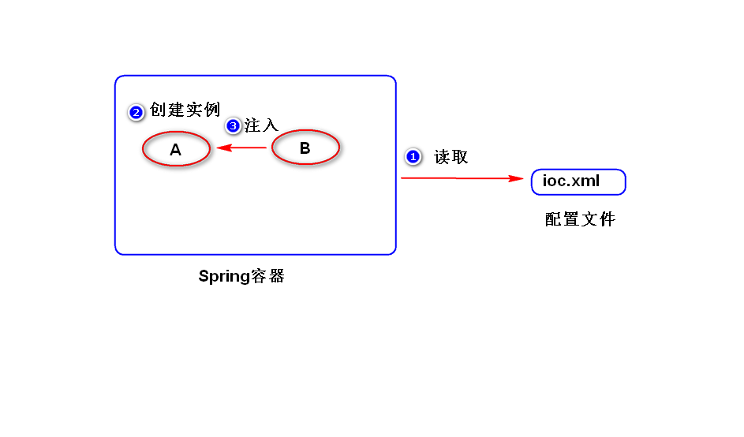
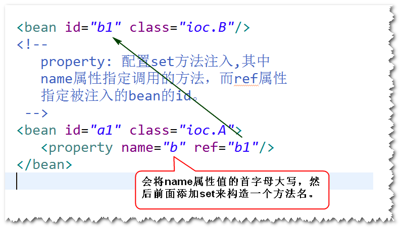
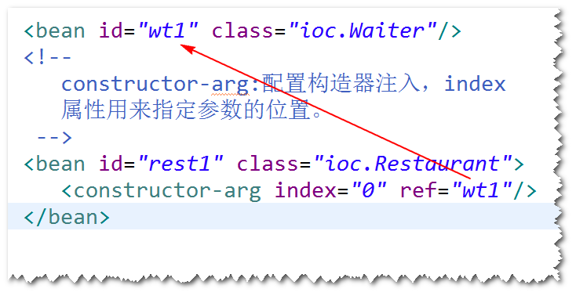

# 1. Spring是什么
	开源的，用来简化企业级应用开发的应用开发框架。
	注:
		a.简化开发: Spring框架对常用的api都做了封装，比如
		对jdbc就做了一套封装(Spring Jdbc),使用SpringJdbc
		访问数据库，就不再需要考虑如何获取连接与关闭连接等
		操作了。
		b.解耦: Spring帮我们管理对象之间的依赖关系（对象之间的耦合度降低了），这样软件的维护性得到提高。
		c.集成其它框架:Spring可以很好地和其它的一些框架进行集成，这样，
		使用这些框架就更方便了。

# 2. Spring容器
## (1)什么是Spring容器?
	Spring框架中的一个核心模块，用来管理对象。
	注:
		管理对象：对象的创建、销毁、初始化等等操作，以及
			对象之间的依赖关系。
## (2)如何启动Spring容器?
	step1.导包。 spring-webmvc
	step2.添加Spring配置文件。
	step3.启动容器。
## (3)如何创建对象?
### 1)方式一 无参构造器
	step1.为类添加无参构造器或者直接使用缺省构造器。
	step2.在配置文件当中，添加bean元素。
	step3.启动容器，调用容器提供的一个方法(getBean)。
### 2)方式二 静态工厂方法(了解)
### 3)方式三 实例工厂方法(了解)
## (4)作用域
	1)默认情况下，对于某个bean元素，容器只会创建一个实例。
	2)如果将作用域设置为"prototype"，容器会创建多个实例。
## (5)生命周期相关的两个方法
### 1)初始化
	使用init-method属性指定初始化方法。
### 2)销毁
	使用destroy-method属性指定销毁方法。
	注意：只有作用域为singleton时，销毁方法才会执行。
## (6)延迟加载(了解)
###	1)默认情况下
	容器启动之后，会将所有作用域为singleton的bean先创建好。
### 2)容器启动之后，对于作用域为singleton的bean,不再创建
	(当调用getBean方法时才会创建）

# 3.IOC和DI
##　1)什么是IOC (Inversion Of Controll 控制反转)?
	对象之间的依赖关系由容器来建立。
## 	2)什么是DI(Dependency Injection 依赖注入)?
	容器通过调用set方法或者构造器来建立对象之间的依赖关系。
	注:
		IOC是目标，DI是手段。

##　3)依赖注入的两种方式
	a.方式一　set方法注入
	step1. 添加set方法。
	step2. 在配置文件当中，使用<property>来配置set方法注入。
	step3. 启动容器，调用getBean方法。

	b.方式二　构造器注入
	step1. 添加相应的构造器
	step2. 在配置文件当中，使用<constructor-arg>来配置构造器注入。
	step3. 启动容器，调用getBean方法。

## 4)自动装配（了解）
	a.容器默认情况下，是不会自动装配的。
	b.可以让容器依据某些规则，自动建立对象之间的依赖关系
	（仍然需要调用set方法或者构造器）。
	
	注：自动装配建议少用，如果要使用，建议使用byName。

	
	
	

	
	  
							
		
		
				

	