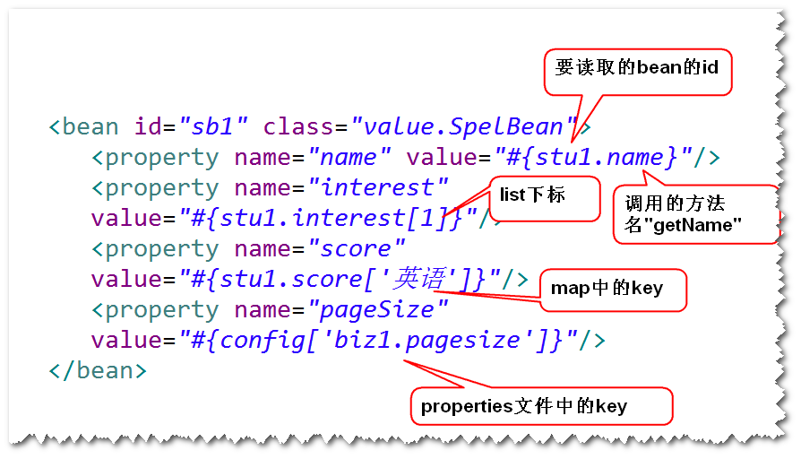

# 1. 注入基本类型的值
	使用value属性 
# 2. 注入集合类型的值
	List,Set,Map,Properties 
## (1)方式一  直接注入
## (2)方式二 引用的方式注入

# 3. 读取properties文件
	

# 4.Spring表达式
	读取bean的属性值或者读取集合类型的值
	

# 5.使用注解简化配置文件
## (1)组件扫描
	1)什么是组件扫描?
		容器会扫描base-package指定的包及其子包
	下面所有的类，如果该类前面有一些特定的注解
	(比如 @Component),则纳入容器进行管理(相当于
	在配置文件当中有一个对应的bean元素一样)。
	2)编程步骤
	step1.在类前面添加一些特定的注解。
		@Component  通用。
		@Repository 持久层。
		@Service   业务层。
		@Controller  控制层。
	step2.在配置文件当中，配置组件扫描。
	

## (2)几个注解
	

## (3)依赖注入相关的几个注解
### 1）@Autowired @Qualifier
	a.支持set方法注入
	
	
	
	b.支持构造器注入
	

### 2)@Resource	

## (4)@Value
	