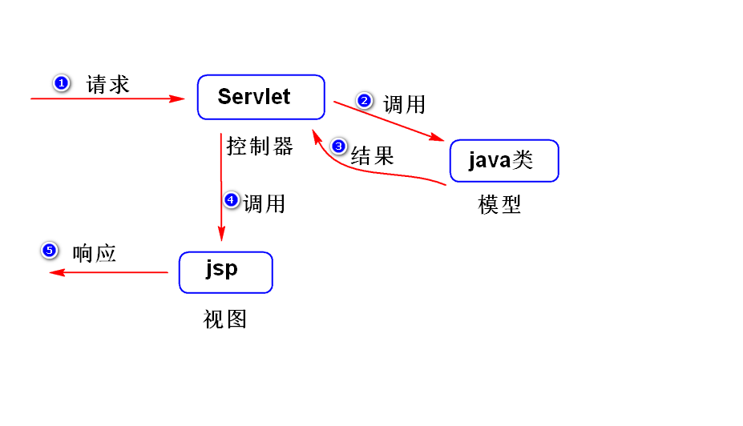
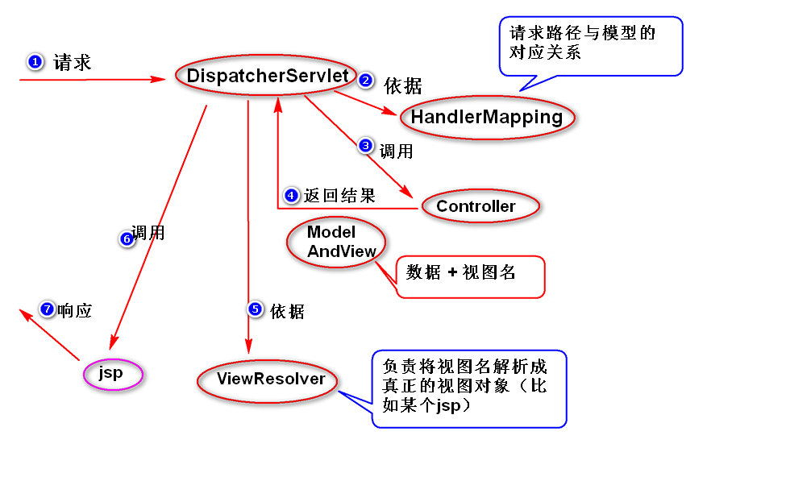
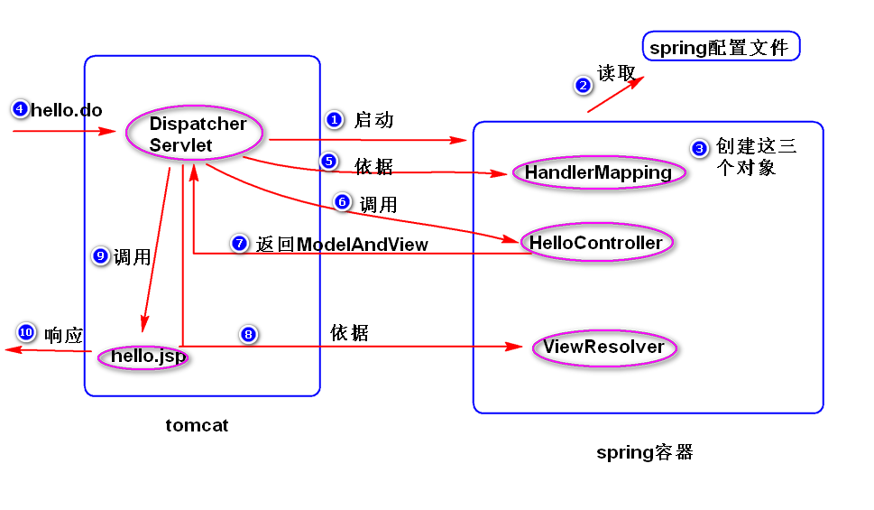

# 1.SpringMVC
## (1)什么是SpringMVC?
	是一个用来简化基于MVC架构的web应用程序开发的应用开发框架。
	注：SpringMVC是Spring框架的一部分。
### 1)MVC (Model 模型 View 视图 Controller 控制器)
	a.什么是MVC?
	是一种软件架构思想，可以将软件划分成三种不同类型的模块，分别
	是模型，视图和控制器。
	模型用于封装业务逻辑的处理，视图用于数据展现和操作界面，
	控制器用于协调模型和视图（视图将请求发送给控制器，由控制器选择
	对应的模型来处理；模型将处理结果交给控制器，由控制器选择合适的
	视图来展现处理结果）。
	b.如何使用MVC?

	
	c.优点
		方便测试 （将业务逻辑写在servlet里面，需要部署之后才能测试，而写在java类里面，可以直接测试）。
		方便代码的维护（修改模型不影响视图，反之也是如此）。
		方便分工协作。

## (2)五大组件
	a.DispatcherServlet  前端控制器
	b.HandlerMapping	映射处理器
	c.Controller		处理器
	d.ModelAndView		模型和视图
	e.ViewResolver		视图解析器

## (3)编程步骤
	step1.导包。
	step2.添加spring配置文件。
	step3.配置DispatcherServlet。
	step4.写Controller。
	step5.写jsp。
	step6.在spring配置文件中，配置HandlerMapping,
		Controller和ViewResolver。

## (4)helloworld案例

			