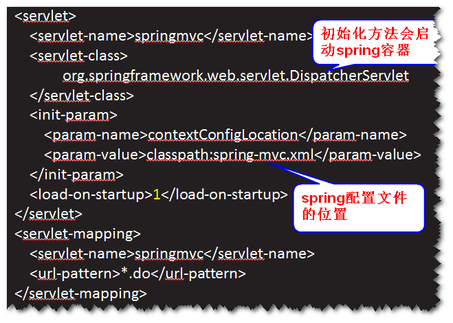
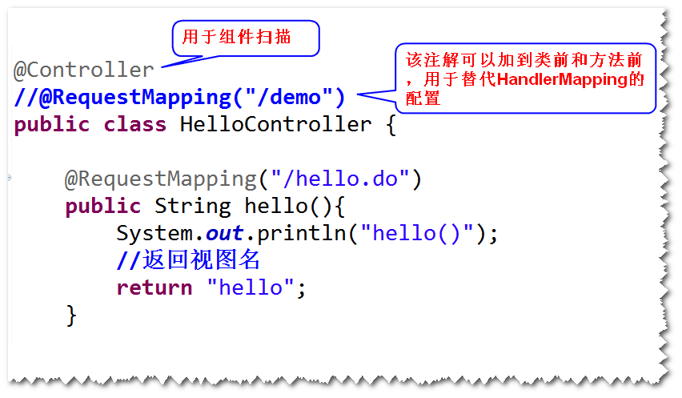
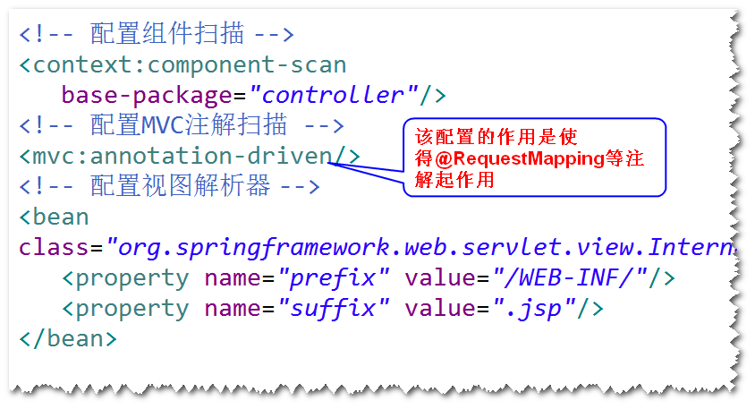

# 1.基于注解的SpringMVC应用
## 1）编程步骤
	step1.导包 (spring-webmvc)
	step2.添加Spring配置文件。
	step3.配置DispatcherServlet。
		注：需要指定初始化参数（因为DispatcherServlet的初始化
		方法会启动Spring容器，所以，需要知道Spring配置文件的位置）。

	step4.写Controller。
		a.不再需要实现Controller接口。
		b.方法名不作要求，返回类型可以是ModelAndView,
		也可以是String。
		c.可以有多个方法。		
		d.在Controller类前添加@Controller。
			注：该注解用于组件扫描。
		e.使用@RequestMapping来代替HandlerMapping的配置。
			注：该注解可以添加到类前面以及方法前面。

	step5.写jsp。
	step6.在Spring的配置文件里面，添加:
			视图解析器，组件扫描，mvc注解扫描
			注：要想让@RequestMapping起作用，需要配置mvc注解扫描。
	

## 2)读取请求参数值(具体参照代码HelloController）
### 方式一  通过request
### 方式二  通过@RequestParam
### 方式三  通过javabean

## 3)向页面传值(具体参照代码HelloController）
### 方式一 绑订数据到request
### 方式二 返回ModelAndView
### 方式三 绑订数据到ModelMap
### 方式四 绑订数据到session

## 4)重定向(具体参照代码HelloController）
### 情形一  方法的返回值是String
		return "redirect:toIndex.do"
### 情形二  方法的返回值是ModelAndView
		RedirectView rv = 
			new RedirectView("toIndex.do");
		ModelAndView mav = 
			new ModelAndView(rv);
		return mav;

		
		