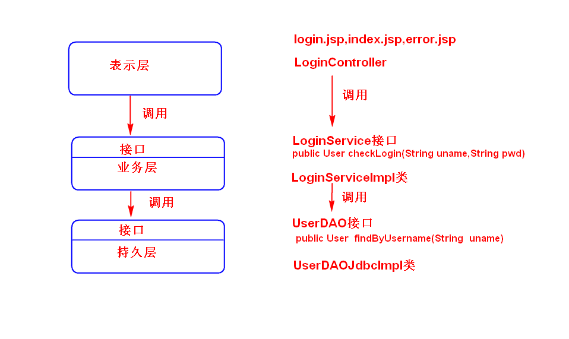
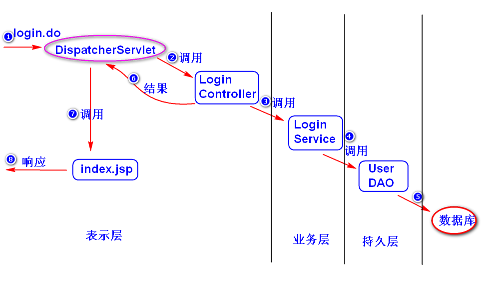
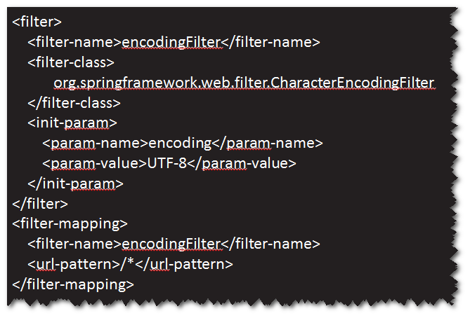

# 1.系统分层（扩展）
## 1)如何分层?
	表示层（UI）：数据展现/操作界面，请求分发。
	业务层（服务层）：封装业务逻辑处理。
	持久层（数据访问层）：封装数据访问逻辑。
## 2)各层之间的关系
	表示层通过接口调用业务层，业务层通过接口调用持久层。
	这样，当下一层的实现发生改变，不影响上一层。
	注：MVC是一种表示层架构思想。

# 2.处理表单中文参数值乱码问题
## (1)乱码问题产生的原因
	表单提交时，浏览器会对表单中文参数值进行编码（会使用打开该表单
	所在页面时的字符集来编码），服务器端默认会使用iso-8859-1来解码。
	所以会产生乱码。
## (2)如何解决
	可以使用SpringMVC提供的过滤器(CharacterEncodingFilter)来解决。
	只需要配置该过滤器即可。需要注意两点。
	a.过滤器的编码设置应该与jsp页面保持一致。
	b.表单的提交方式设置为POST。

	