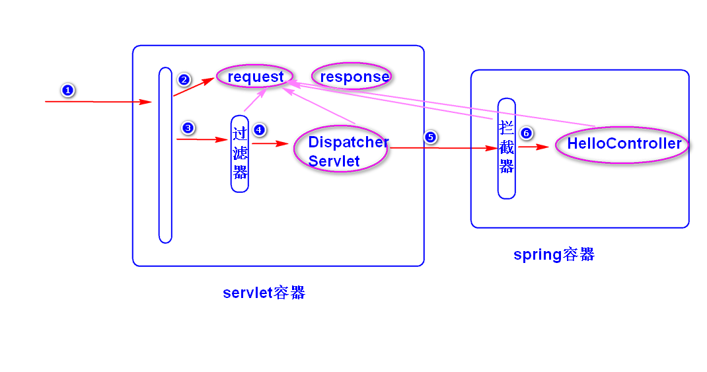
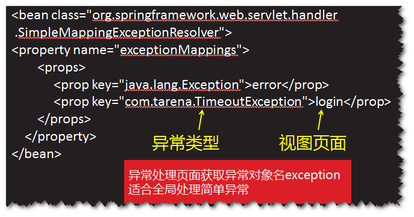
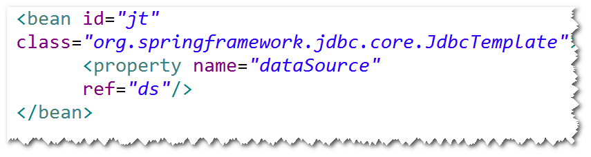

# 1. 拦截器
## (1)什么是拦截器?
	DispatcherServlet收到请求之后，如果有拦截器，则先执行
	拦截器的方法，再执行处理器(Controller)的方法。
	注：
		过滤器属于Servlet规范，拦截的是Servlet容器调用过程，
		而拦截器属于Spring框架，拦截的是DispatcherServlet的调用过程。

## (2)如何写拦截器?
	step1. 写一个java类，实现HandlerInterceptor接口。
	step2. 在接口方法当中，实现拦截处理逻辑。
	step3. 配置拦截器。

## (3)拦截器的优先级
	依据配置的先后顺序执行。

# 2.SpringMVC中的异常处理
	注：可以将异常抛给Spring框架，由Spring框架来处理异常。
## (1)配置简单异常处理器。
	step1.配置简单异常处理器。

	step2.添加异常处理页面。
## (2)使用@ExceptionHandler注解
	step1.在处理器类里面增加一个异常处理方法，
	该方法前面需要添加@ExceptionHandler。
	注：Spring框架捕获到异常之后，会调用异常处理方法。
	step2.在异常处理方法里面，编写异常处理逻辑。
	step3.添加异常处理页面。

# 3. SpringJdbc
## (1)SpringJdbc是什么?
	Spring框架对jdbc的封装。
	注：比起直接使用jdbc，使用SpringJdbc代码更简洁，质量更高。
	比如，不用考虑获取连接与关闭连接等操作。
## (2)如何使用?
	step1.导包。
		spring-webmvc,spring-jdbc,ojdbc,dbcp,junit。
	step2.添加Spring配置文件。
	step3.配置JdbcTemplate。

	 
	step4.调用JdbcTemplate提供的方法来访问数据库。
		注：
			通常将JdbcTemplate注入到DAO。	

练习：	使用@ExceptionHandler处理登录产生的异常。

	

	