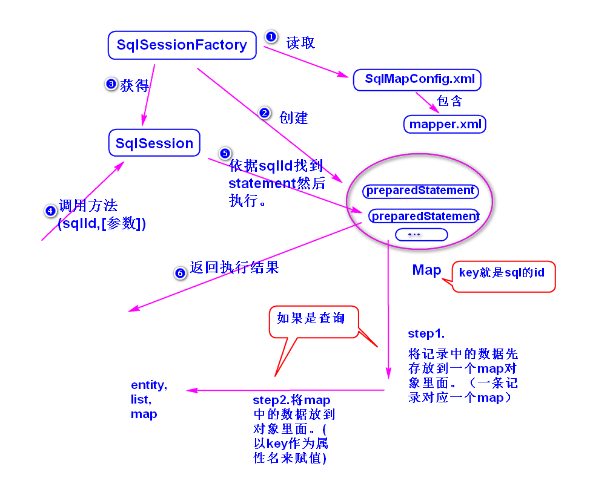
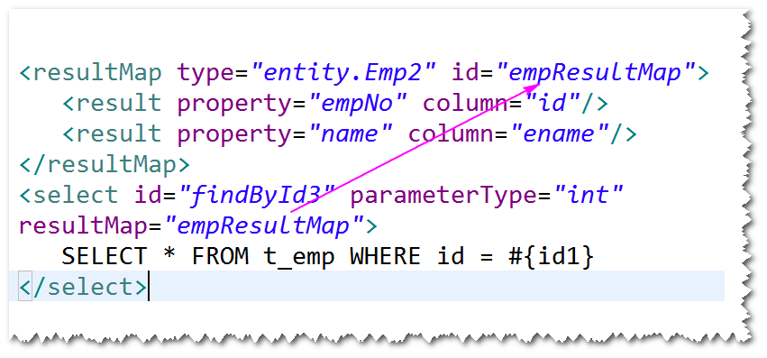

# 1.MyBatis
## (1)MyBatis是什么?
	开源的持久层框架。
	(了解)
		jdbc  易掌握，性能好，代码繁琐，易出错。
		hibernate 难掌握，性能不好，代码非常简洁，
				虽然不用写sql,但经常需要优化sql。
	    mybatis  比较容易掌握，性能一般，代码简洁，
				需要写sql。
## (2)编程步骤
	step1. 导包。
		mybatis,ojdbc,junit。
	step2.添加配置文件 (SqlMapConfig.xml)
	step3.实体类。
		注：属性名要与表的字段名一样（大小写可以忽略）。
	step4.添加映射文件。
		注：告诉mybatis,如何进行对象关系映射，里面主要是一些
			sql语句。
	step5.修改配置文件，添加映射文件的位置。
	step6.调用mybatis提供的api访问数据库。
		注: 主要是调用SqlSession类提供的方法。

## (3)工作原理（了解）	

## (4)返回Map类型的结果
	mybatis会将查询到的记录先存放到map对象里面（以字段名作为
	key,以字段值作为value,一条记录对应一个map）,再将map中存放的
	数据添加到实体对象（默认以key作为属性名来赋值）。
	注：
		返回Map类型的结果，可以不用写实体类，但是取字段值时，
		需要调用get方法，需要考虑字段名的差异（比如oracle数据库
		会将字段名大写）。
		建议还是返回实体对象取值方便。

## (5)解决实体类的属性名与表的字段名不一致的情况。
	方式一　使用别名
			SELECT name as ename...
	方式二　使用resultMap元素

## (6)Mapper映射器
### 1)Mapper映射器是什么?
	 是一个符合映射文件要求的接口。
	注：mybatis会生成一个符合该接口的实现类。
### 2)如何使用Mapper映射器?
	 step1.定义接口
		a. 方法名必须与sqlId一样。
		b. 参数类型必须与parameterType一样。
		c. 返回类型必须与resultType一样。
	 step2.映射文件中的namespace必须等于接口名(全限定名)。
	 step3.调用SqlSession提供的getMapper方法。
		　
		
	
		 
		 
		