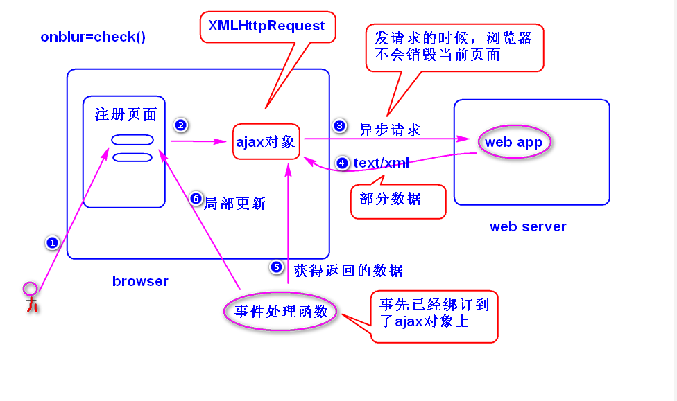

# 1. ajax (asynchronous javascript and xml)  
## (1)什么是ajax?  
	是一种用来改善用户体验的技术，本质是利用浏览器提供的一个
	特殊对象(ajax对象，即XMLHttpRequest对象)向服务器发送
	异步请求，服务器返回部分数据，浏览器利用这些数据对当前页面
	做部分更新，整个过程，页面无刷新，不打断用户的操作。

	注：
		异步请求，指的是当ajax对象发送请求时，浏览器不会销毁当
		前页面，用户仍然可以对当前页面做其它操作。

		
##　(2)如何获得ajax对象?
	function getXhr(){
		var xhr = null;
		if(window.XMLHttpRequest){
			//非ie
			xhr = new XMLHttpRequest();
		}else{
			xhr = new ActiveXObject('MicroSoft.XMLHttp');
		}
		return xhr;
	}
##  (3)ajax对象的几个重要属性
	1)onreadystatechange:绑订事件处理函数（用来处理	readystatechange事件）。
		注：当readyState属性性发生了变化（比如从１变成了２），就会产生readystatechange事件。
	2)readyState：有５个值(0,1,2,3,4),用来获得ajax对象与服务器
		通信的进展。当这个值为4时，表示ajax对象已经获得了服务器
		返回的所有的数据。
	3)responseText：获得服务器返回的文本数据。
	4)responseXML:获得服务器返回的xml数据。
	5)status:获得服务器返回的状态码。

## (4)编程步骤
	step1. 获得ajax对象，比如
	var xhr = getXhr();
	step2. 发送请求。
	1)get请求
		xhr.open(请求类型,请求地址,true/false);
		注：
			true:异步请求。
			false:同步请求（当ajax对象发送请求时，浏览器会锁定当前
					页面）。
		xhr.onreadystatechange = 事件处理函数;
		xhr.send(null);
	比如:
		xhr.open('get','check.do?uname=Sally',true);
		xhr.onreadystatechange = handle;
		xhr.send(null);
	
	2)发送post请求
		xhr.open('post','check.do',true);
		xhr.setRequestHeader('content-type',
			'application/x-www-form-urlencoded');
		xhr.onreadystatechange = handle;
		xhr.send('uname=Sally");
		注：
			按照http协议要求，如果发送的是post请求，请求数据包里
			面应该包含有content-type消息头，而默认情况下，ajax对象
			在发送请求时，不会添加该消息头。

	
	step3.编写服务器端的代码。
		通常只需要返回部分数据。
	step4.编写事件处理函数。
		if(xhr.readyState == 4 && 
			xhr.status == 200){
			var txt = xhr.responseText;
			...
		}

## (5)缓存问题
### 1)什么是缓存问题?
	ie浏览器提供的ajax对象在发送get请求时，会比较请求地址，
	如果访问过，则不再发送新的请求，而是显示之前访问的结果（
	会将第一次访问的结果缓存下来）。
### 2)如何解决?
	在请求地址后面添加一个随机数。

## (6)编码问题
### 1)发送get请求
	a.为什么会有乱码?
	 ie所提供的ajax对象在发送请求时，会使用gbk编码，而其它
	浏览器会使用utf-8来编码。
	　服务器端默认会使用iso-8859-1来解码，所以，会产生乱码。
	b.如何解决?
	  step1.服务端统一使用utf-8来解码。
			<Connector  URIEncoding="utf-8"/>
	  step2.在浏览器端，使用encodeURI函数对中文参数进行编码。
### 2)发送post请求
	a.为什么会有乱码?
		浏览器提供的ajax对象在发送请求时，会使用utf-8编码，
		服务器端默认会使用iso-8859-1来解码，所以会产生乱码。
	b.如何解决?
		request.setCharacterEncoding("utf-8");			   
		