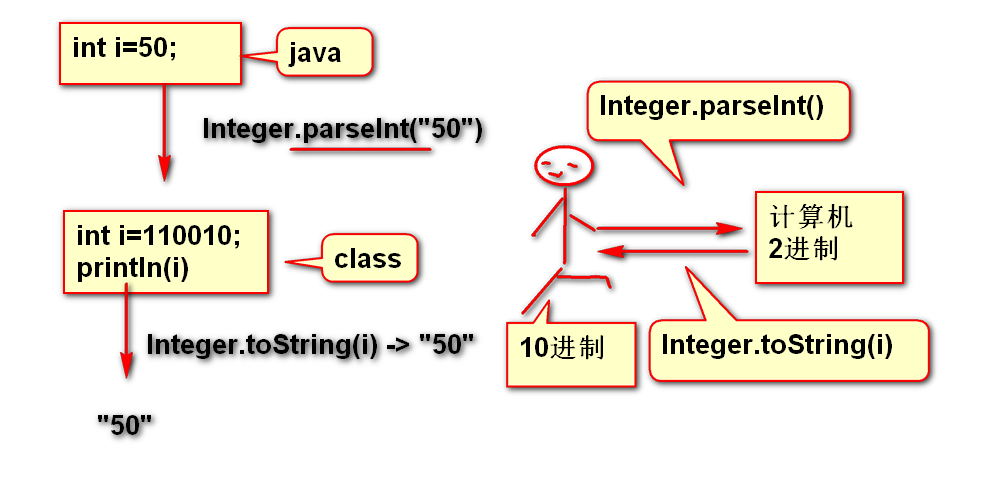
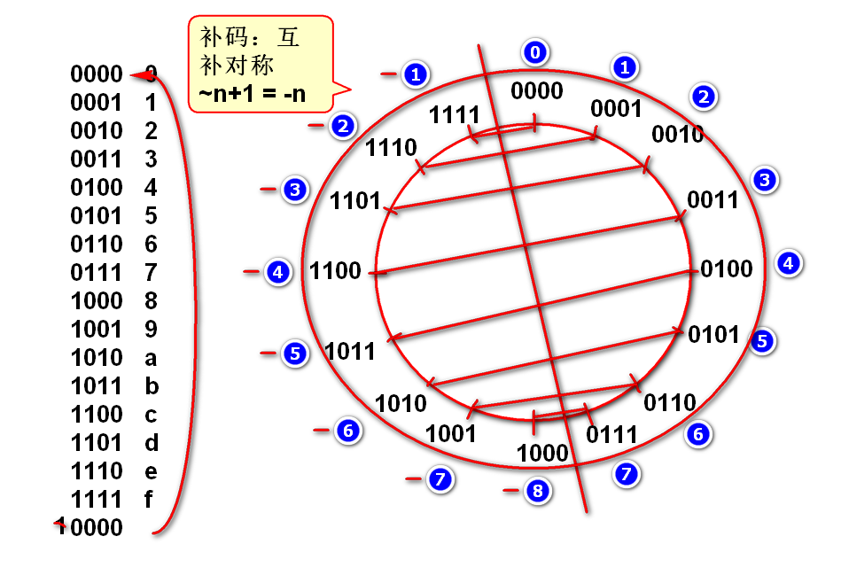

面试题目: 
	
	System.out.println(51 & 7);
	如上代码的结果是(__3__)	
	答案：

	00000000 00000000 00000000 00110011
	00000000 00000000 00000000 00000111
	
	
# 2进制

1. 计算机内部“只有”2进制数据。
2. 任何信息都必须转换为2进制，再由计算机处理。

案例：

	int i = 50;
	System.out.println(Integer.toBinaryString(i));

## 什么是2进制

逢2进1的计数规则：

## 16进制

2进制书写十分不方便：

	00100111 10100010 10111111 01011101

利用16进制缩写（简写）2进制，目的就是方便书写

## 补码

4位数补码：

经典题目：

	int i = 0xffffffff;
	System.out.println(i);
	选择如上代码输出结果（  ）
	A.2147483647 B.-2147483648 C.2147483648 D.-1
	> 答案： D

### 补码的互补对称现象

经典题目：

	int i = 8;
	System.out.println(~i+1);
	如上代码输出结果（  ）
	A.8 B.-8 C.9 D.-9
	> 答案: B

	int i = -8;
	System.out.println(~i+1);
	如上代码输出结果（  ）
	A.8 B.-8 C.9 D.-9
	> 答案: A

	int i = -8;
	System.out.println(~i);
	如上代码输出结果（  ）
	A.8 B.-8 C.9 D.-9 E.7
	> 答案: E

## 2进制的运输符

 ~ 取反  & 与运算   | 或运算  >>> 逻辑右移位  >> 数学右移位 <<左移位

案例：
	
	将一个中文字拆分为UTF-8编码的字节。

### & 与运算（逻辑乘法）
	 
	运算规则：

	0 & 0 = 0
	0 & 1 = 0
	1 & 0 = 0
	1 & 1 = 1
	
案例：
		
	n =     00000000 00000000 01001110 00101101 
	m =     00000000 00000000 00000000 00111111
	k = n&m 00000000 00000000 00000000 00101101 
	
	//如上运算的结果： k是n的后6位数！
	
	int n = 0x4e2d;
	int m = 0x3f;
	int k = n&m;
	//2进制输出

### | 或运算(逻辑加法)

基本运算规则：
	
	0 | 0 = 0
	1 | 0 = 1
	0 | 1 = 1
	1 | 1 = 1

案例：

	int k =     00000000 00000000 00000000 00110101
	int n =     00000000 00000000 00000000 10000000
	int m = k|n 00000000 00000000 00000000 10110101 

代码：

	int k = 0x35;
	int n = 0x80;
	int m = k|n;
	//验证结果：按照2进制输出

### `>>>` 逻辑右移位

规则：
		
	2进制数字整体向右移动，高位补0

案例:

	n =        00000000 00000000 00000000 10101101
	m = n>>>1  000000000 00000000 00000000 1010110
	k = n>>>2  0000000000 00000000 00000000 101011 

代码：

	int n = 0xad;
	int m = n>>>1;
	int k = n>>>2;
	//按照2进制输出。

### 移位运算的数学意义

复习
	
	n =   1302332.
	m =  13023320.  m 是 n的10倍
	k = 130233200.  k 是 n的100倍
	
	如果看做小数点不动，则数字向左移动
	
2进制时候，规律依然存在： 数字向左移动一次，扩大2倍

	n =      00000000 00000000 00000000 00110010. 50
	m =n<<1  0000000 00000000 00000000 001100100. 100
	k =n<<2  000000 00000000 00000000 0011001000. 200

案例：

	int n = 50;
	int m = n<<1;
	int k = n<<2;
	//int t = n<<(65%32);
	//输出n，m，k的十进制和2进制

经典
	
	优化计算 n*8 
	答：（ n<<3 ）
 
### 比较 >>> 和 >>

>> 数学右移位：满足数学规律（小方向取整）正数高位补0，负数高位补1，保持符号不变。

>>> 逻辑右移位：无论正负高位都补0

案例：

	n  =    11111111 11111111 11111111 11001101  -51
	m=n>>1  111111111 11111111 11111111 1100110  -26
	k=n>>2  1111111111 11111111 11111111 110011  -13

	x=n>>>1 011111111 11111111 11111111 1100110  发生符号反转

--------------------------------------------

